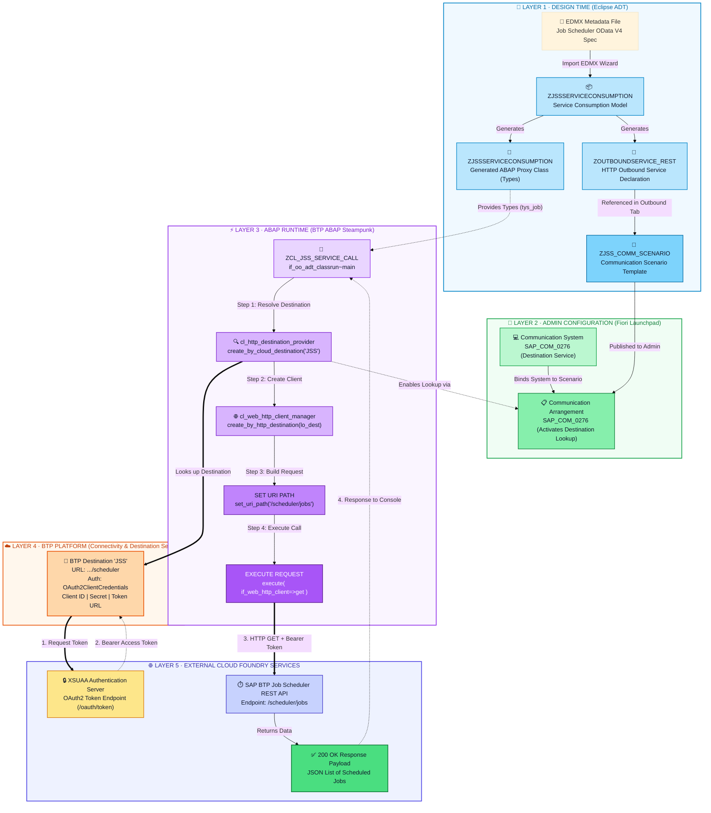
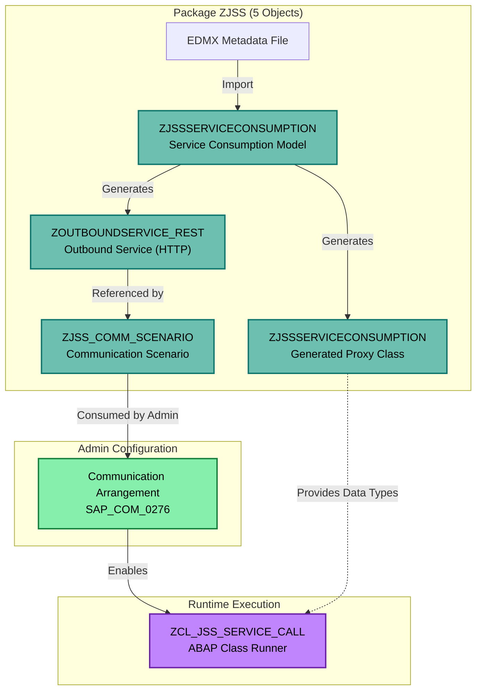

# SAP BTP ABAP Environment → Job Scheduler Integration via Destination Service

[](https://cloudplatform.sap.com)
[](https://community.sap.com/topics/abap)
[](https://oauth.net/2/)
[](LICENSE)

End-to-end architecture and implementation guide for calling the **SAP Job Scheduler REST API** from the **SAP BTP ABAP Environment (Steampunk)** using the standard **Destination Service** path.

> [!NOTE]  
> **Key Architectural Insight**: OAuth2 token retrieval and authorization header injection are handled automatically by the BTP Destination Service framework (`cl_http_destination_provider=>create_by_cloud_destination`). The ABAP code never touches client credentials, secrets, or manual token logic.

---

## 📋 Table of Contents
- [System Specifications](#-system-specifications)
- [BTP Cockpit Destination Configuration](#-btp-cockpit-destination-configuration)
- [End-to-End Architecture Diagram](#-end-to-end-architecture-diagram)
- [Step-by-Step Implementation Guide](#-step-by-step-implementation-guide)
  - [Step 1 · Create Service Consumption Model (EDMX)](#step-1--create-service-consumption-model-edmx)
  - [Step 2 · Create Outbound Service](#step-2--create-outbound-service)
  - [Step 3 · Create Communication Scenario](#step-3--create-communication-scenario)
  - [Step 4 · Create Communication System](#step-4--create-communication-system)
  - [Step 5 · Create Communication Arrangement](#step-5--create-communication-arrangement)
  - [Step 6 · Configure BTP Cockpit Destination](#step-6--configure-btp-cockpit-destination)
  - [Step 7 · Write ABAP Code](#step-7--write-abap-code)
  - [Step 8 · Response Payload](#step-8--response-payload)
- [Object-by-Object Detailed Breakdown](#-object-by-object-detailed-breakdown)
  - [Package Structure — ZJSS (5 Objects)](#package-structure--zjss-5-objects)
  - [Object Flow Diagram](#object-flow-diagram)
  - [Detailed Breakdown & Analogies](#detailed-breakdown--analogies)
- [ABAP Source Code](#-abap-source-code)
- [Artifacts Summary](#-artifacts-summary)

---

## ⚙️ System Specifications

| Parameter | Value / Details |
| :--- | :--- |
| **BTP Environment** | SAP BTP ABAP Environment (Trial - Shared US10) |
| **ABAP System ID** | `TRL_EN` (TRL, Client 100, User CB9980005587, EN) |
| **System Web Host** | `https://e9233ee0-105b-4c71-893f-d4b6f0ddd36a.abap-web.us10.hana.ondemand.com` |
| **Development IDE** | Eclipse ADT (ABAP Development Tools) |
| **Package** | `ZJSS` |

---

## 🔑 BTP Cockpit Destination Configuration

A destination named **`JSS`** must be configured in BTP Cockpit under your subaccount connectivity:

| Field | Configuration Value |
| :--- | :--- |
| **Name** | `JSS` |
| **URL** | `https://jobscheduler-rest.cfapps.us10.hana.ondemand.com/scheduler` |
| **Authentication** | `OAuth2ClientCredentials` |
| **Client ID** | `sb-228520c9-2109-4c48-a1d0-0f9eaaf64bfc|sap-jobscheduler!b1` |
| **Token Service URL** | `https://7e221c01trial.authentication.us10.hana.ondemand.com/oauth/token` |

---

## 🏗️ End-to-End Architecture Diagram



---

## 🛠️ Step-by-Step Implementation Guide

### Step 1 · Create Service Consumption Model (EDMX)
- **Object**: `ZJSSSERVICECONSUMPTION`
- **Tool**: Eclipse ADT
- **Input**: EDMX metadata file downloaded from the Job Scheduler OData V4 service.
- **What it does**: Imports external service metadata (entity types, function imports) and generates ABAP proxy types like `tys_job`, `tyt_job`, and constants for entity sets (`JOBS`, `RUN_LOGS`, `SCHEDULES`).

```text
Eclipse ADT Procedure:
Right-click Package ZJSS → New → Other ABAP Repository Object → Business Services → Service Consumption Model → Remote Consumption Mode = OData → Upload EDMX → Finish.
```

### Step 2 · Create Outbound Service
- **Object**: `ZOUTBOUNDSERVICE_REST`
- **Type**: HTTP
- **What it does**: Pure metadata object declaring that your ABAP system needs to make outbound HTTP calls.

```text
Eclipse ADT Procedure:
Right-click Package ZJSS → New → Other ABAP Repository Object → Cloud Communication Management → Outbound Service → Service Type = HTTP.
```

### Step 3 · Create Communication Scenario
- **Object**: `ZJSS_COMM_SCENARIO`
- **What it does**: Bundles the outbound service (`ZOUTBOUNDSERVICE_REST`) into a scenario template for Fiori launchpad consumption.

```text
Eclipse ADT Procedure:
Right-click Package ZJSS → New → Other ABAP Repository Object → Cloud Communication Management → Communication Scenario → Add ZOUTBOUNDSERVICE_REST in Outbound tab → Publish Locally.
```

### Step 4 · Create Communication System
- **Tool**: Fiori Launchpad App (`F1762` - Communication Systems)
- **Scenario**: `SAP_COM_0276`
- **What it does**: Registers the BTP Destination Service as a trusted external communication system.

### Step 5 · Create Communication Arrangement
- **Tool**: Fiori Launchpad App (`F1763` - Communication Arrangements)
- **Scenario**: `SAP_COM_0276`
- **What it does**: Binds the Communication Scenario to the Communication System and activates `cl_http_destination_provider=>create_by_cloud_destination('JSS')`.

### Step 6 · Configure BTP Cockpit Destination
- **Tool**: BTP Cockpit $\rightarrow$ Connectivity $\rightarrow$ Destinations
- **Name**: `JSS`
- **Auth**: `OAuth2ClientCredentials` (URL, Client ID, Secret, Token Service URL).

### Step 7 · Write ABAP Code (`ZCL_JSS_SERVICE_CALL`)
- **Object**: `ZCL_JSS_SERVICE_CALL`
- **Interface**: `IF_OO_ADT_CLASSRUN` (Executable via F9 in Eclipse ADT).

### Step 8 · Response Payload
Sample JSON response output returned by GET `/scheduler/jobs`:

```json
{
  "total": 1,
  "results": [
    {
      "jobId": 7675697,
      "name": "TEST",
      "action": "HTTPS://TEST.COM",
      "active": true,
      "httpMethod": "GET",
      "ACTIVECOUNT": 0,
      "INACTIVECOUNT": 5
    }
  ]
}
```

---

## 📖 Object-by-Object Detailed Breakdown

### Package Structure — `ZJSS` (5 Objects)

```text
TRL_EN [TRL, 100, CB9980005587, EN]
└── Favorite Packages
    └── ZJSS (5 objects)
        ├── Business Services
        │   └── Service Consumption Models
        │       └── ZJSSSERVICECONSUMPTION          Job Scheduler Service Consumption
        ├── Cloud Communication Management
        │   ├── Communication Scenarios
        │   │   └── ZJSS_COMM_SCENARIO             Communication Scenario
        │   │       └── Outbound Service
        │   │           └── ZOUTBOUNDSERVICE_REST      (referenced)
        │   └── Outbound Services
        │       └── ZOUTBOUNDSERVICE_REST          HTTP Outbound Service
        └── Source Code Library
            └── Classes
                ├── ZCL_JSS_SERVICE_CALL           Call BTP Job Scheduler API
                │   ├── IF_OO_ADT_CLASSRUN~MAIN    (method)
                │   └── ZCL_JSS_SERVICE_CALL       (text elements)
                └── ZJSSSERVICECONSUMPTION          Consumption Model (generated proxy class)
```

---

### Object Flow Diagram



---

### Detailed Breakdown & Analogies

#### 1. `ZJSSSERVICECONSUMPTION` (Service Consumption Model)
- **Location**: Business Services $\rightarrow$ Service Consumption Models
- **Analogy**: API Client SDK Generator (like OpenAPI/Swagger spec to TypeScript).
- **Purpose**: Generates ABAP proxy types (`tys_job`, `tyt_job`) and constants from the external EDMX specification.

#### 2. `ZOUTBOUNDSERVICE_REST` (Outbound Service)
- **Location**: Cloud Communication Management $\rightarrow$ Outbound Services
- **Analogy**: Android manifest `uses-permission` declaration.
- **Purpose**: Pure metadata registration declaring outbound HTTP communication intent to ABAP Cloud.

#### 3. `ZJSS_COMM_SCENARIO` (Communication Scenario)
- **Location**: Cloud Communication Management $\rightarrow$ Communication Scenarios
- **Analogy**: Infrastructure Blueprint / Terraform Module.
- **Purpose**: Bundles outbound services and permitted auth methods for admin consumption in Fiori Launchpad.

#### 4. `ZCL_JSS_SERVICE_CALL` (ABAP Class Runner)
- **Location**: Source Code Library $\rightarrow$ Classes
- **Analogy**: MVC Controller.
- **Purpose**: Executable runtime class (`if_oo_adt_classrun`) orchestrating destination lookup, HTTP execution, and console output.

#### 5. `ZJSSSERVICECONSUMPTION` (Generated Proxy Class)
- **Location**: Source Code Library $\rightarrow$ Classes
- **Analogy**: TypeScript `.d.ts` type definition file.
- **Purpose**: Generated class containing ABAP structures and constants for OData V4 client proxy calls.

---

## 💻 ABAP Source Code

```abap
CLASS zcl_jss_service_call DEFINITION
  PUBLIC FINAL CREATE PUBLIC.
  PUBLIC SECTION.
    INTERFACES if_oo_adt_classrun.
ENDCLASS.

CLASS zcl_jss_service_call IMPLEMENTATION.
  METHOD if_oo_adt_classrun~main.
    TRY.
        " 1. Look up BTP destination 'JSS' via Destination Service
        " Requires active Communication Arrangement SAP_COM_0276
        DATA(lo_dest) = cl_http_destination_provider=>create_by_cloud_destination(
            i_name = 'JSS' ).

        " 2. Create HTTP client — OAuth2 token auto-injected by framework
        DATA(lo_client) = cl_web_http_client_manager=>create_by_http_destination(
            lo_dest ).

        " 3. Append /jobs to destination base URL (/scheduler)
        DATA(lo_request) = lo_client->get_http_request( ).
        lo_request->set_uri_path( i_uri_path = '/scheduler/jobs' ).

        " 4. Execute GET request — Bearer token automatically attached
        DATA(lo_response) = lo_client->execute( if_web_http_client=>get ).
        DATA(lv_status) = lo_response->get_status( ).
        DATA(lv_body) = lo_response->get_text( ).

        " 5. Output response to ADT Console (F9)
        out->write( |Status: { lv_status-code } { lv_status-reason }| ).
        out->write( lv_body ).

      CATCH cx_web_http_client_error INTO DATA(lx_http).
        out->write( |HTTP Error: { lx_http->get_text( ) }| ).
      CATCH cx_http_dest_provider_error INTO DATA(lx_dest).
        out->write( |Destination Error: { lx_dest->get_text( ) }| ).
      CATCH cx_root INTO DATA(lx_root).
        out->write( |Error: { lx_root->get_text( ) }| ).
    ENDTRY.
  ENDMETHOD.
ENDCLASS.
```

---

## 📊 Artifacts Summary

| # | Artifact Name | Type | Created In |
| :--- | :--- | :--- | :--- |
| **1** | `ZJSSSERVICECONSUMPTION` | Service Consumption Model | Eclipse ADT |
| **2** | `ZOUTBOUNDSERVICE_REST` | Outbound Service (HTTP) | Eclipse ADT |
| **3** | `ZJSS_COMM_SCENARIO` | Communication Scenario | Eclipse ADT |
| **4** | Communication System | Scenario `SAP_COM_0276` | Fiori Launchpad |
| **5** | Communication Arrangement | Scenario `SAP_COM_0276` | Fiori Launchpad |
| **6** | Destination `JSS` | `OAuth2ClientCredentials` | BTP Cockpit |
| **7** | `ZCL_JSS_SERVICE_CALL` | ABAP Class | Eclipse ADT |

---

## 📝 License
This project is licensed under the MIT License - see the [LICENSE](LICENSE) file for details.